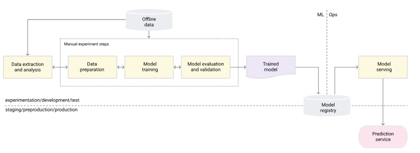

NourishAI
==============================
A food vision project made by PyTorch and with implementation of MLOps.

The project structure is inspired by [cookiecutter-data-science](https://drivendata.github.io/cookiecutter-data-science/).

Right now, MLOPs is at level 0. The model is trained on


It's also hosted on [gradio space](https://huggingface.co/spaces/mazenAI/livine-demo)

### You can install the model using downloading the image using
```docker
docker pull pascaldev/nourish:latest
```
#### and run it by
```docker
docker run -d --name test -p 80:80 pascaldev/nourish
```
#### then access to http://127.0.0.1/docs and click on predict and try it on

### OR

#### You can simply send a POST request to http://127.0.0.1/predict with the body

```json
{
    "file": "LOCAL_IMAGE_FILE_PATH"
}
```
#### Expected result:
```json
{
    "label": "PREDICTED_LABEL"
}
```

## Packages Used
- PyTorch (for model training) & Torchvision (for data loading)
- DVC (Data Version Control) for data versioning
- WandB (Weights and Biases) for experiment tracking
- Tox (for testing on multiple python versions)
- Docker (for containerization) 
- Pillow (for image processing)

## Upcoming
- [ ] Add CI/CD
- [ ] Add Streamlit
- [ ] Add Pytest


The dataset used is Food-101 dataset. It is a dataset of 101 food categories, with 101,000 images. For more information, visit [here](https://www.kaggle.com/dansbecker/food-101).

The model can differentiate between food and non-food images.

Right now the model is trained on 30% of the dataset, and the accuracy is 56% on the test set.

